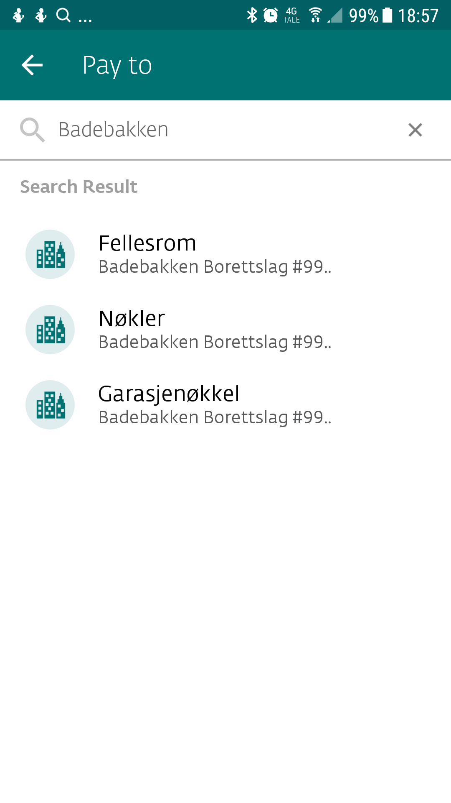

# Tjenester for beboere

## Skilt til postkasser og dørklokke

Borettslaget oppgraderte postkasseanlegget for noen få år siden, og for å holde
anlegget ensartet og pent så vil borettslaget sørge for å bestille
postkasseskilt uten ekstra kostnad for den enkelte beboer. Dersom endringen av
skilt er av svært kort varighet, så si fra om dette, så vil vi lage et i papir i
stedet for plast. Det kan ta noe tid å få levert postkasseskilt, i slike
tilfeller vil vi gi beboere et midlertidig skilt på tykt papir i påvente av
levering av det ordentlige skiltet.

Dørklokkeanlegget skal ikke ha klistremerker på utsiden. Det er veldig enkelt å
få oppdatert dørklokken sin, det er bare å fylle inn skjemaet, så vil det
oppdateres av styret.

[Klikk her for å bestille skilt til postkasse og dørklokke](https://docs.google.com/forms/d/e/1FAIpQLSfgW1gl_E9iEWHyGYzq_DVP90UUz5ZfnpPgiDMzrwPk8cLAhg/viewform)

## Registering av epost og mobiltelefon

Badebakken borettslag har elektroniske meldingstjenester, som vi ønsker at
andelseierne i størst mulig grad benytter seg av, slik at vi enkelt og raskt kan
informere beboere om hendelser.
[Klikk her for å registrere epost og mobiltelefon hos USBL](https://www.usbl.no/min-side/min-profil)

## Skjema for garasjeplasser

Her kan man:

- Sette seg på liste for de som ønsker å kjøpe biloppstillingsplass i garasjen
- Sette seg på liste for de som ønsker å leie biloppstillingsplass i garasjen
- Registrere at man ønsker å selge sin biloppstillingsplass i garasjen, og motta liste over interesserte.
- Registrere at man ønsker å leie ut sin biloppstillingsplass i garasjen, og motta liste over interesserte.
- Sette seg på venteliste for de som ønsker å leie motorsykkelplass av borettslaget.
- Registrere utleie av sin biloppstillingsplass
- Registrere at man ønsker å fjerne seg fra en eller flere av listene

Bortsett fra leie av motorsykkelplass så er det ikke noen venteliste som
vedlikeholdes av styret. Den enkelte beboer står fritt til å kjøpe og leie ut
til andre, innenfor det vedtektene setter ramme for. Det innebærer at man må
selge til andelseiere i borettslaget som ikke allerede eier oppstillingsplass
for bil, men at man kan leie ut fritt, så lenge det er til enkeltpersoner. Det
er dog ønskelig at utleie også skjer til beboere i borettslaget.

[Gå til skjemaet for garasjeplasser](https://docs.google.com/forms/d/e/1FAIpQLSdQOiomrjTzcAzCJKBbbxvmSgoW7Mi1pxnPXL8qcLKJZjXQzQ/viewform)

## Nøkler og garasjeportåpner

Ta kontakt med ansvarlig for nøkler og garasjeportåpner, Hege S. Moen.
Kontaktinformasjon er her: [] Betaling skjer helst via VIPPS. Konto 99480 for
nøkler til oppgangene og 99481 for garasjeportåpnere. Man kan evt. søke opp
«Badebakken» under betalingssiden.

## Bestilling av fellesrom

Booking av fellesrom må gjøres ved å kontakte ansvarlig for utleie. Du kan se om
det er ledig en spesifikk [Google-kalenderen for
fellesrommet](https://calendar.google.com/calendar/embed?src=hesgrmil4lqq08fjk5mbdm3f1k%40group.calendar.google.com&ctz=Europe%2FParis).
Betaling gjøres helst via VIPPS til 99479. Du kan evt. søke opp «Badebakken» så
vil du finne en konto som heter Fellesrom. Alternativt kan man også betale via
faktura.

## Utleie av leilighet

Dette administreres av USBL, det er bare å [fylle ut et
skjema](https://usbl.no/for-deg/utleie-av-bolig).

## Andre henvendelser

Borettslagets styre kan kontaktes på styret@badebakken.no. Se ellers kontaktinformasjon.
