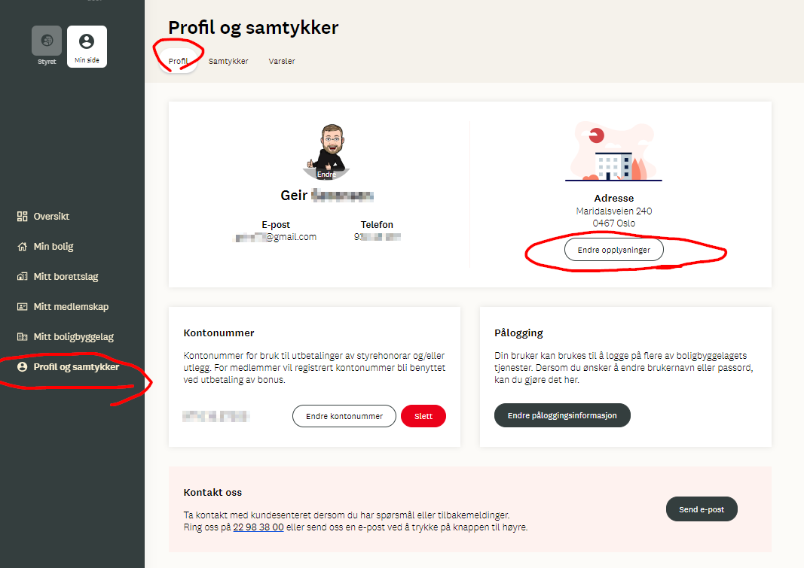
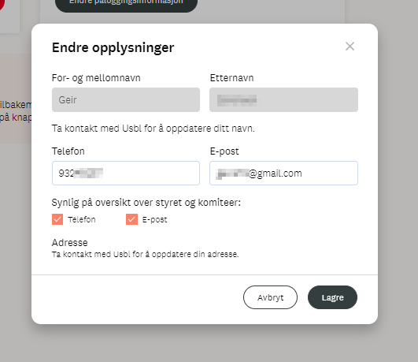
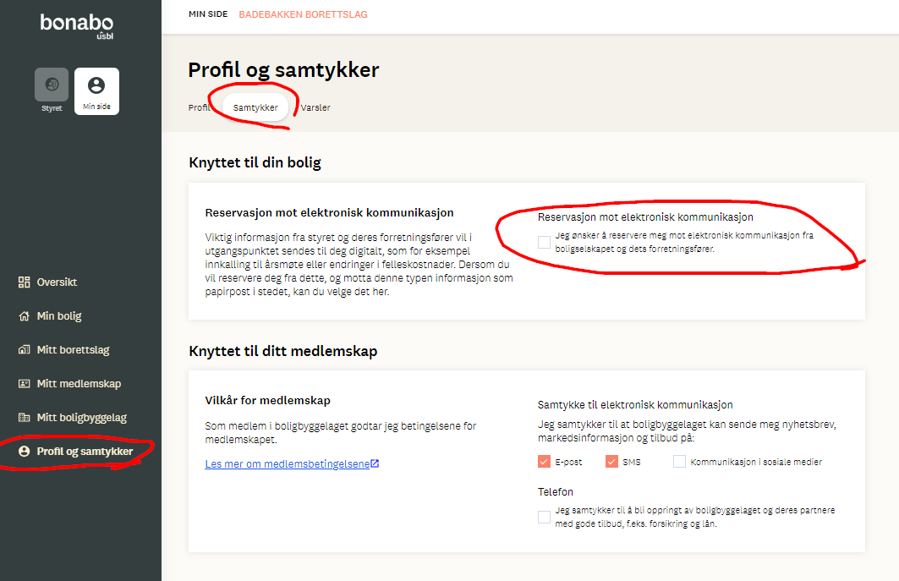
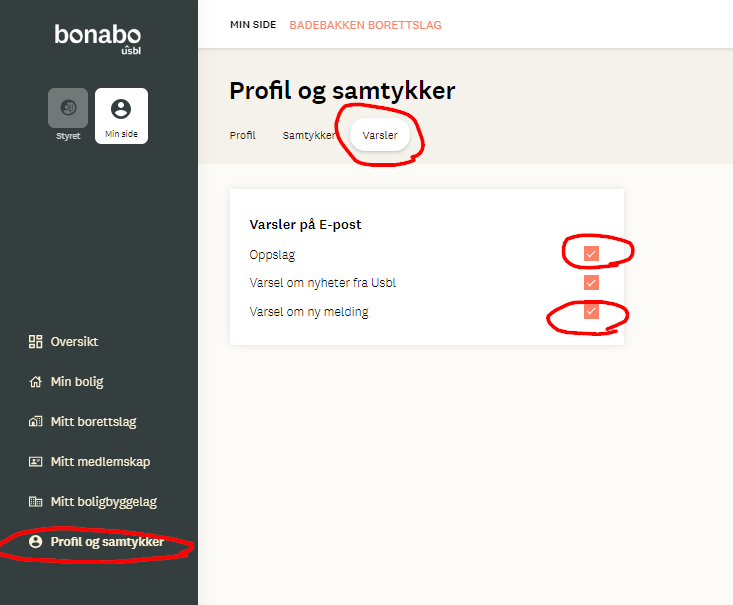

# Elektronisk kommunikasjon

For at borettslaget skal kunne kommunisere med deg, er det viktig at innstillingene på Bonabo-portalen er riktige. Om du ikke har logget inn der ennå er det på tide å gjøre det. Adressen er <https://usbl.bbl.no/minside/>.

## 1. Profil

Etter å ha logget inn, finn valg for "Profil og samtykker"

* web: nederst til i menyen i venstre marg
* mobil: trykk på menysymbolet øverst til høyre og gå litt nedover

Det ser slik ut på web:

Om opplysningene ikke stemmer, trykk på "Endre opplysninger"-knappen, og gjør oppdateringene som trengs.

## 2. Samtykke

For at styret i borettslaget skal kunne kommunisere med deg via portalen, må du IKKE være reservert mot dette. Pass på at avkryssingsboksen under "Knyttet til din bolig - Reservasjon mot elektronisk kommunikasjon" er blank.

Neste seksjon "Knyttet til ditt medlemskap" er opp til deg hvordan du ønsker å krysse av, det skal kun handle om hva USBL kan kontakte deg for.

## 3. Varsler

De færreste logger seg på Bonabo hele tiden for å se om det er noe nytt. Derfor er det viktig å krysse av for at man ønsker epost om det skjer noe nytt. Vi anbefaler at du minst krysser av for "Varsler på E-post" for "Oppslag" og for "Varsel om ny melding".

