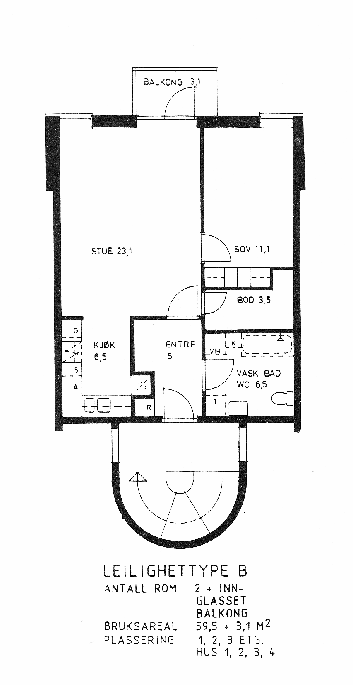
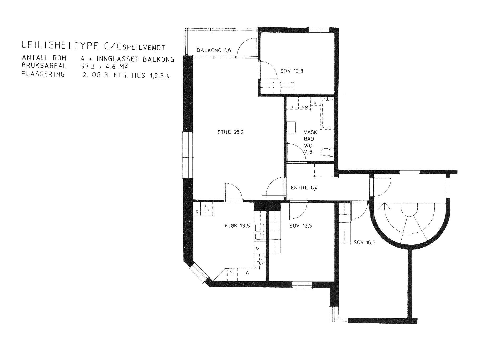

# Leilighetstyper i Badebakken borettslag

## Type A

Disse leilighetene befinner seg på yttersidene i første etasje i lavblokkene
(232, 234, 238, 240). Leilighetene til høyre for inngangen er speilvendte
(omtalt som As). Andelsnummer: 01, 03s, 13, 15s, 45, 47s, 57 og 59s. Totalt 8,
halvparten speilvendte. Klikk på bildet for større versjon.

## Type B

Disse leilighetene befinner seg i midt første til tredje etasje i lavblokkene
(232, 234, 238, 240). Andelsnummer: 02, 05, 08, 14, 17, 20, 23, 46, 49, 52, 48,
61, 64. Totalt 12. Klikk på bildet for større versjon.

## Type BL

Disse leilighetene befinner seg i midt i fjerde etasje i lavblokkene (232, 234,
238, 240). L står for loft, fordi det er skrå tak her.
Andelsnummer: 11, 23, 55, 67. Totalt 4. Klikk på bildet for større versjon.

## Type C

Disse leilighetene befinner seg på yttersidene i andre og tredje etasje i
lavblokkene (232, 234, 238, 240). Leilighetene til høyre for inngangen er
speilvendte (omtalt som Cs). Andelsnummer: 4, 6s, 7, 9s, 16, 18s, 19, 21s, 48,
50s, 51, 53s, 60, 62s, 63, 65s. Totalt 16, halvparten speilvendte. Klikk på
bildet for større versjon.

## Type D

Disse leilighetene befinner seg på yttersidene i fjerde etasje i lavblokkene
(232, 234, 238, 240). Leilighetene til høyre for inngangen er speilvendt (omtalt
som Ds). Andelsnummer: 10, 12s, 22, 24s, 54, 56s, 66, 68s. Totalt 8, halvparten
speilvendte. Klikk på bildet for større versjon.

## Type E

Disse leilighetene befinner seg på yttersidene av 236 i første til fjerde
etasje. Leilighetene til høyre sett fra gårdsplassen er speilvendte, omtalt som
Es. Andelsnummer: 25, 28s, 29, 32s, 33, 36s, 37, 40s. Totalt 8, halvparten
speilvendte. Klikk på bildet for større versjon.

## Type EL

Disse leilighetene befinner seg på yttersidene av 236 i femte etasje. L står for
loft, siden det er skrå tak her. Leiligheten til høyre sett fra gårdsplassen er
speilvendt, omtalt som ELs. Andelsnummer: 41, 44s. Klikk på bildet for større
versjon.

## Type G

Disse leilighetene befinner seg på midten av 236 i første til fjerde etasje.
Leilighetene til høyre sett fra gårdsplassen er speilvendte, omtalt som Gs.
Andelsnummer: 26, 27s, 30, 31s, 34, 35s, 38, 39s. Totalt 8, halvparten
speilvendt. Klikk på bildet for større versjon.

## Type GL

Disse leilighetene befinner seg på midten av 236 i femte etasje. L står for
loft, siden det er skrå tak her. Leiligheten til høyre sett fra gårdsplassen er
speilvendt, omtalt som GLs. Andelsnummer: 42, 43s. Klikk på bildet for større
versjon.

## Type H og HL

H-leilighetene befinner seg på venstre side av 242 sett fra inngangen, fra
første til tredje etasje. HL ligger i fjerde. L står for loft, siden det er skrå
tak i HL-leiligheten. Andelsnummer: 69, 73, 77, 81 (HL). Klikk på bildet for
større versjon.

## Type J

Disse leilighetene befinner seg på midten av 242 i første til fjerde etasje.
Leilighetene til høyre sett fra gårdsplassen er speilvendte, omtalt som Js.
Andelsnummer: 70, 71s, 74, 75s, 78, 79s, 82, 83s. Totalt 8, halvparten
speilvendt. Klikk på bildet for større versjon.

## Type K og KL

H-leilighetene befinner seg på høyre side av 242 sett fra inngangen, fra første
til tredje etasje. KL ligger i fjerde. L står for loft, siden det er skrå tak i
KL-leiligheten. Andelsnummer: 72, 76, 80 og 84(KL). Klikk på bildet for større
versjon.

## Oppsummering

| Type  | Bruksareal *) | Kommentar                                               | Antall 1988 | Antall 2018 |
| :---- | :------------ | :------------------------------------------------------ | :---------- | :---------- |
| A     | 84,6 / 80,0   | Endeleiligheter 1. etasje M232,234,238,240              | 8           | 7           |
| B     | 62,6 / 59,5   | Midtleiligheter 1-3. etasje lavblokker M232,234,238,240 | 12          | 10          |
| BL    | 59,5          | Midtleiligheter, 4. etasje, lavblokker M232,234,238,240 | 4           | 4           |
| C     | 101,9 / 97,3  | Endeleiligheter 2-3. etasje lavblokker M232,234,238,240 | 16          | 15          |
| D     | 102,3         | Endeleiligheter 4. etasje lavblokker M232,234,238,240   | 8           | 8           |
| E     | 74,4 / 68,5   | Endeleiligheter 1-4. etasje M236                        | 8           | 8           |
| EL    | 68,5          | Endeleiligheter 5. etasje M236                          | 2           | 2           |
| G     | 101,0 / 93,0  | Midtleiligheter 1-4. etasje M236                        | 8           | 8           |
| GL    | 93,0          | Midtleiligheter 5. etasje M236                          | 2           | 1           |
| H     | 72,0 / 61,6   | Venstre endeleiligheter 1-3. etasje M242                | 3           | 3           |
| HL    | –             | Finnes ingen etter loftsutbygging M242 H0401            | 1           | 0           |
| J     | 84,0 / 77,0   | Midtleiligheter 1-4. etasje M242                        | 8           | 8           |
| K, KL | 102,7 / 95,7  | Høyre endeleiligheter 1-4. etasje M242                  | 4           | 4           |

Fram til 2018 har det blitt foretatt to sammenslåinger av leiligheter og to
utbygginger av leiligheter. Styret har derfor laget noen uformelle betegnelser
for disse leilighetstypene.

| Type | Bruksareal        | Kommentar                               | Antall 2018 |
| :--- | :---------------- | :-------------------------------------- | :---------- |
| AB   | 147,2/139,5       | Sammenslått av typen A + B              | 1           |
| BC   | 164,5/156,8       | Sammenslått av typene B + C             | 1           |
| HLU  | 72,0 + loftsareal | HL med utbygget loft. Ferdig ca. 2005.  | 1           |
| GLU  | 93,0 + loftsareal | GL med utbygget loft. Blir ferdig 2019? | 0           |
