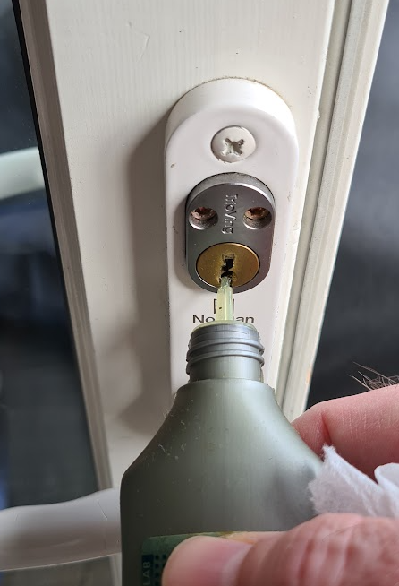
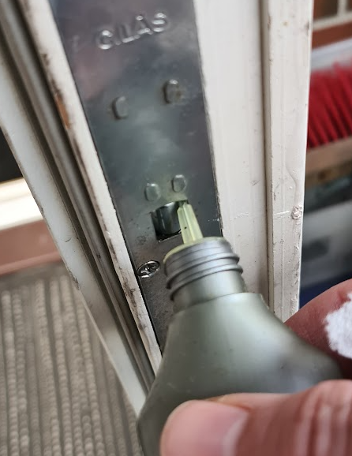
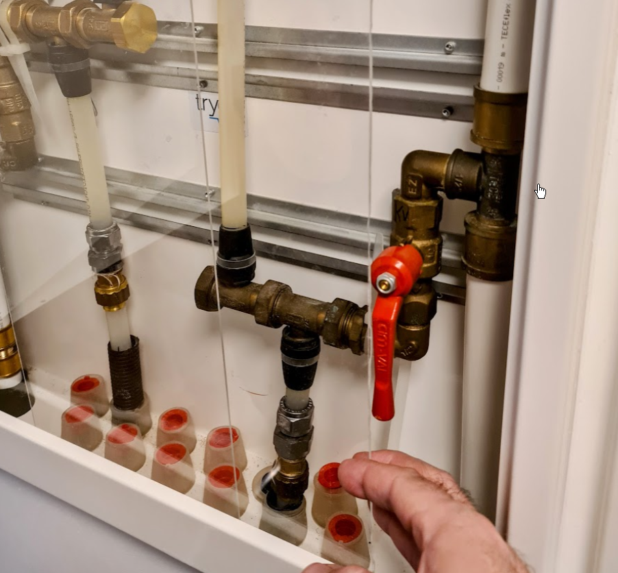
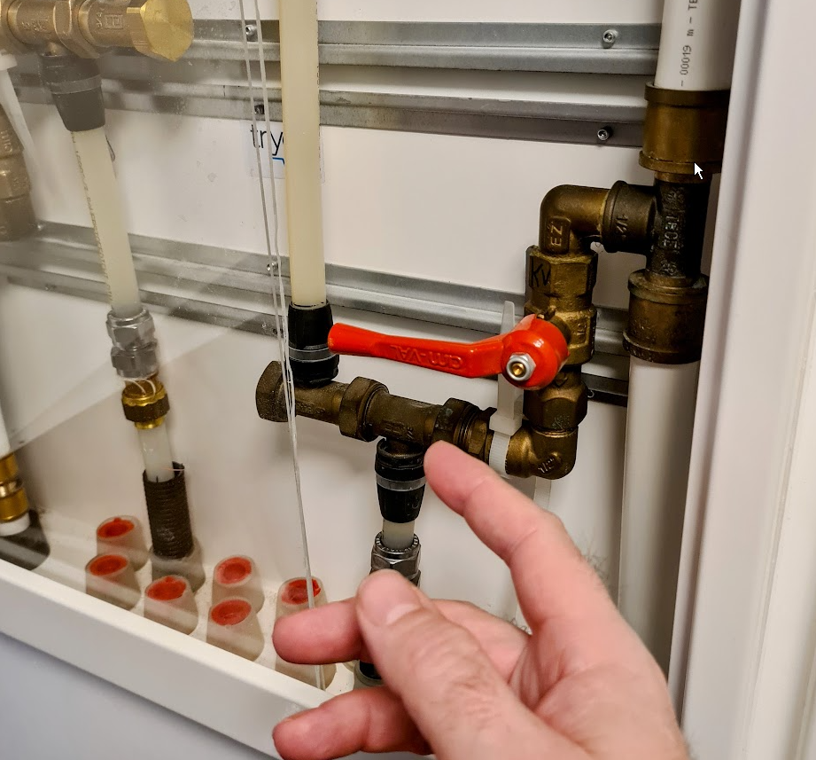

# Periodisk vedlikehold

Andelseierne må utføre en del vedlikehold selv, eller sørge for at det utføres om leiligheten er bruksoverlatt (utleid). Ikke alt som er nevnt i [vedtektenes § 5-1 om vedlikeholdsplikt](https://badebakken.no/informasjon/vedtekter-og-regler/) er nevnt her, så det anbefales å lese disse også.

## Årlige vedlikeholdsoppgaver

Velg en dato og sett den i kalenderen. Noen oppgaver er det best å gjøre før vinter, slik som oljing av dørlåser, andre er det best å gjøre på en varm sommerdag.

### Olje lås på balkongdør

Om leiligheten har balkongdør så bør den smøres opp med låseolje en gang i året, gjerne på høsten. Låseolje kan kjøpes på jernvarebutikker og kanskje fortsatt også på bensinstasjoner.

Merk: Låsene på fellesdører (de med de runde nøkkelhullene) skal aldri oljes, da kan de bli skadet.

### Aktivere kuleventiler

I fordelingsskapene for vann i hver leilighet er det kuleventiler i vannfordelingsskap. Om disse ikke aktiveres av og til vil de bli veldig trege og vanskelige å betjene. Derfor er det viktig at man stenger og åpner disse en gang i året.

1. Pass på at det ikke er noe eller noen som aktivt bruker vann i leiligheten (oppvaskmaskin, vaskemaskin, dusjing, etc.)
2. Åpne skapet og skyv de gjennomsiktige plastplatene til side
3. Lukk ventilene og åpne dem igjen umiddelbart, i en jevn og rolig bevegelse. Ventilen for varmtvann kan være litt varm (50-60 grader), så bruk en genser eller gryteklut om du ønsker.
4. Viktig: Plasser de gjennomsiktige plastikkplatene tilbake slik at de dekker hele åpningen. Plastikken skal ligge på innsiden av selve åpningen. Dette vil hindre at vannsprut ved lekkasje i selve skapet ikke får kommet seg ut gjennom sprekkene i luken.

### Olje treverk på balkong

## Jevnlige oppgaver

Enkelte punkter gjelder bare for leiligheter som har dette utstyret.

* Fjerne fett på avtrekkshette og filter. Dette fettet kan ta fyr om det begynner å brenne på komfyren.
* Rensing av sluk på balkonger
