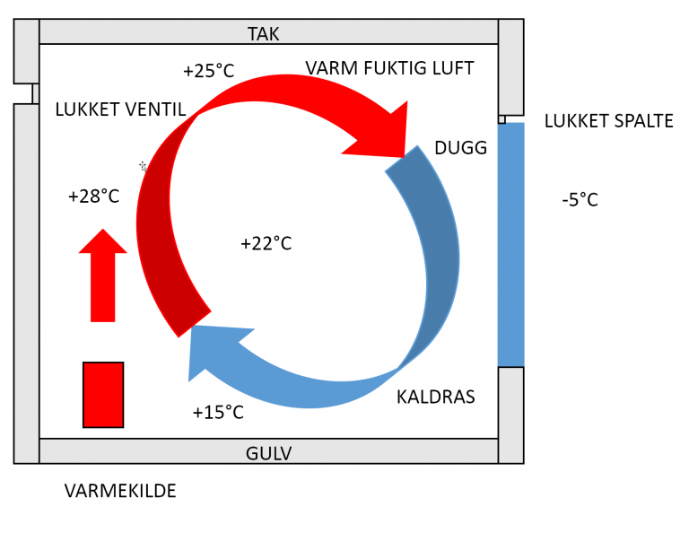
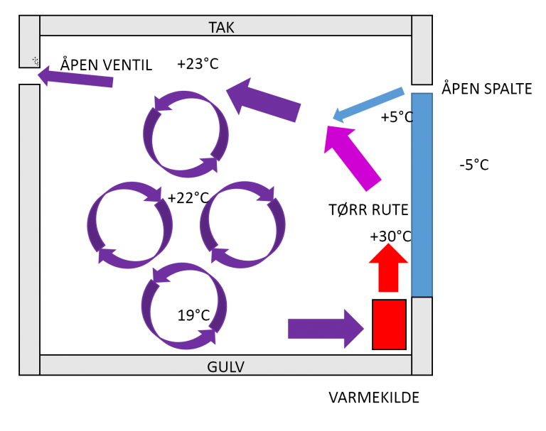

# Ventilasjon i leilighetene

Her er litt informasjon om hvordan ventilasjon fungerer i leilighetene i vårt
borettslag.

## Avtrekkshette på kjøkken

Det er ikke tillatt å ha motorisert avtrekkshette på kjøkkenet, med mindre den
fører luften tilbake i rommet og ikke inn i ventilasjonssystemet. De som
monterer motorisert avtrekkshette vil ødelegge undertrykket i
ventilasjonssystemet og i verste fall blåse stekeosen sin inn til naboene. Ta
kontakt med styret dersom du lurer på detaljer omkring dette. Flexit leverer
flere typer [avtrekkshetter beregnet for fellesanlegg][flexit] med konstant
avtrekk, og det er enkelt å bestille gjennom de store byggevarekjedene.
[RørosHetta][røros] skal også ha modeller for felles avtrekk. Et annet
alternativ kan være [Villavent][villavent]. _Vær oppmerksom på at det av og til
er full gjennomgang av ventilasjonsanlegget, og da vil alle eiere av
ureglementerte anlegg bli pålagt å gjøre utbedringer, som må godkjennes, til
beboers egen kost._

Avtrekkshettens spjeld skal kunne justeres slik at det er en viss trekk også når
spjeldet er igjen. Det er svært viktig at det er noe avtrekk også i lukket
tilstand, fordi all luft i leiligheten skiftes ut gjennom kun to steder:
avtrekkshetten på kjøkkenet og på baderommet. Se mer om dette lenger ned.

[flexit]: <https://www.flexit.no/produkter/kjokkenvifte/kjokkenhette_for_fellesanlegg/>
[røros]: <https://roroshetta.no/produktutvalg/>
[villavent]: <https://www.villavent.shop/kjokkenhetter-for-aggregat-og-fellesavtrekk>

## Inneklima

Over alle vinduer er det luftspalter som sørger for at det kommer luft inn i
leilighetene. Disse luftspaltene må stå åpne hele døgnet for å sikre god og
riktig utskifting av luft. Dersom luftspalter stenges vil leiligheten kunne få
et for høyt innhold av giftige gasser, soppsporer og kjemikalier fra
vaskemidler, vegger, gulv og tekstiler. En fuktig leilighet vil også kunne gi
opphav til sopp. Selv om du opplever at det blir litt kaldere, eller at du må
bruke litt mer penger på oppvarming, ber vi alle beboere om å sørge for at
lufteventiler står åpne hele året. Videre anbefaler vi at det luftes godt 1-2
ganger i døgnet ved å åpne vinduer.

Dersom spaltene lukkes vil det dannes undertrykk i leiligheten og kald luft vil
komme inn andre veier, slik som gjennom stikkontakter og bak listverk. Det blir
også vanskelig å åpne utgangsdøren.

Det er viktig at det er åpning under hver eneste dør inne i leiligheten slik at
luften trekker gjennom ytre rom og inn i indre rom med avtrekk, slik som på
baderom. Det finnes også dører med luftspalter, eller man kan sette inn ventiler
i lettveggene. Det andre stedet luften blir trukket ut er gjennom avtrekkshetten
på kjøkkenet. Spjeldet på denne må aldri lukke seg helt. Dersom avtrekk fra bad
og kjøkken hindres, vil luften i leiligheten bli svært dårlig, særlig i
vintersesongen.

## Gulvkaldt?

Med mindre man har installert gulvvarme, så bør det være montert panelovn eller
varmelist under alle vindusflater. De fleste er vel kjent med at varm luft er
lettere enn kald luft. I et rom vil derfor kalde flater (yttervegger generelt og
vinduer spesielt) føre til en sirkulasjon av kald luft ned mot gulvet. Dette
fenomenet kalles kaldras. Man bør for all del unngå å sette en ovn midt på
stuegulvet uten andre varmekilder i rommet. Da vil det skapes varm oppvind midt
i rommet som vil gå ut mot vinduene og forsterke den kalde trekken mot gulvet.
Har man derimot plassert varme-kildene under vinduene vil den varme luften stige
opp og hindre den kalde luften å synke ned på gulvet, slik som på figuren viser.

Dugger det på vinduene?

- Tørketrommel skal ha kondensator, det er __påbudt__
- Avtrekkshetten skal ha spjeld som kan åpnes ved matlaging. Det skal lukke seg
  av seg selv etter en stund. Dette er __påbudt__. Motorisert avtrekkshette er
  __forbudt__, da blåser du mat-osen rett inn i naboens leilighet. Et unntak er
  om du har en løsning med motorisert avtrekkshette med filter og utlufting ut i
  rommet, og et åpent avtrekk et annet sted på kjøkkenet.
- Dersom du driver og lager mat ved å koke lenge, må du huske på å aktivere
  spjeldet med jevne mellomrom så det ikke lukker seg.
- Har du åpnet nok luftspalter over vinduene? Gå bort til inngangsdøra og hør
  om det piper der, om det er mye undertrykk i leiligheten din har du ikke nok
  inn-luft fra spaltene. Luften kommer seg inn likevel, f.eks. gjennom
  stikkontakter, men gjennomstrømmingen blir dårligere og avtrekket likeså.
  eller under baderomsdøren? Originalt var det luftspalte under baderomsdøren
- Lukk igjen baderomsdøren ved dusjing, og la den stå igjen til rommet er tørt i
  igjen. Dersom det holder seg fuktig der har du kanskje glemt å ha ventilasjon
  da borettslaget ble bygget.
- Dugger det inne i vinduene, ikke på innsiden? Da har du en punktering! Kontakt
  styret for å få skiftet vinduet.
- Har du eller tidligere beboer byttet ventilasjonsluker på badet slik at de kan
  lukkes helt igjen? Isåfall må du skru dem litt opp slik at det er avtrekk.
- Ble det gulvkaldt? Se avsnittet over om plassering av varmekilder.

## Litt om anleggene

Ventilasjonssystemet er i bunn og grunn det samme som da blokkene ble
ferdigstilt på slutten av 80-tallet. Motor er byttet ut i flere av bygningene
etter at de har gått i stykker, og styringssystemet er også oppgradert i
forbindelse med dette.

Anlegget prøver hele tiden å holde avtrekket innenfor akseptable grenser, dvs.
at det er nok undertrykk til at kravene til ventilasjon (dvs. utbytting av luft)
i leilighetene er opprettholdt. Dersom f.eks. alle åpner spjeldene på
kjøkkenhettene, vil viftene begynne å jobbe hardere for å opprettholde
undertrykket, mens de roer seg ned igjen når spjeldene lukkes.

Det er også en viss tidsstyring inne i bildet, slik at avtrekket er sterkere i
morgenrushet og ved middagstid.
