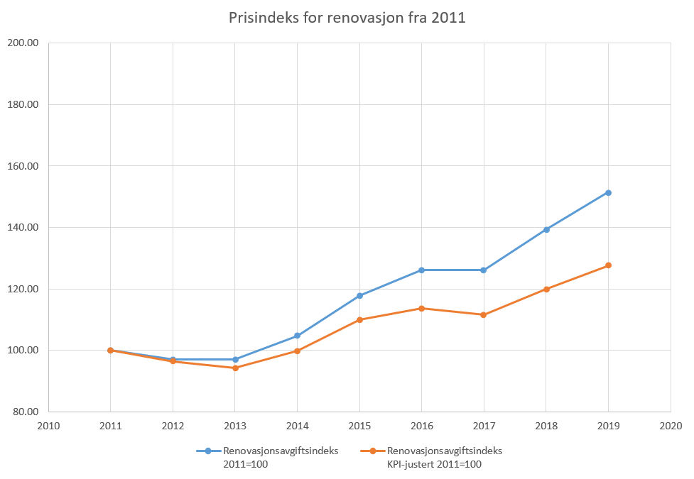
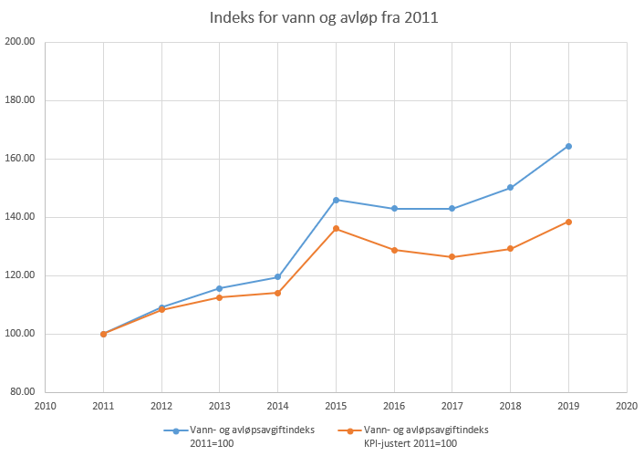
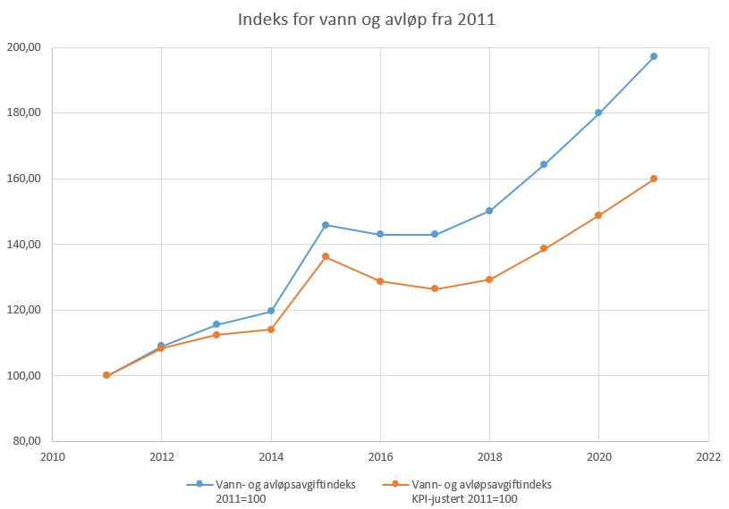
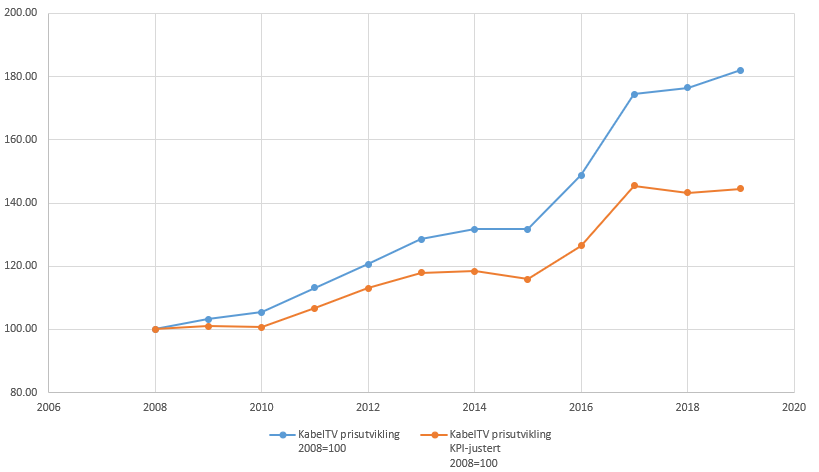
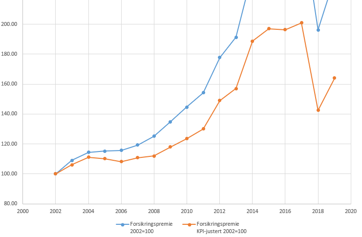

# Økonomien i borettslaget

Styret vil i denne artikkelen orientere hvordan økonomien i borettslaget
fungerer. Formålet er å gi beboerne en bedre forståelse av hvordan styret
forsøker å håndtere fortløpende utgifter og langsiktige investeringer. Vi
beskriver drifts– og finansutgifter, inntekter og budsjettering, og hvordan
utgiftene fordeles mellom andelseierne i borettslaget.

## Drift og vedlikeholdsutgifter

Figuren på denne siden viser fordelingen av drifts- og vedlikeholdskontrakter
for 2018. Under reparasjon og vedlikehold kommer både små og store prosjekter.
En annen stor utgiftspost er kommunale avgifter.

## Vedlikehold og reparasjoner

Borettslaget må fortløpende vedlikeholde og reparere borettslagets eiendom og
utstyr. Styret kan på egenhånd vedta å bestille nødvendig vedlikehold, men alt
av større anskaffelser og innkjøp vedtas av generalforsamlingen.

Dersom det skal tas opp felleslån der bankens sikkerhet kommer foran innskuddene
i borettslaget, er det også nødvendig med generalforsamlingsvedtak, men
borettslaget er nå så likvid og har såpass lite gjeld at dette neppe blir
aktuelt fremover.

## Kommunale avgifter

I vårt borettslag utgjør [vann- og
avløpsgebyr](https://www.oslo.kommune.no/vann-og-avlop/priser-beregninger-og-vannmaler/vann-og-avlopsgebyrer/)
og
[renovasjonsgebyr](https://www.oslo.kommune.no/avfall-og-gjenvinning/renovasjonsgebyr-og-priser/)
store andeler av felleskostnadene.

Renovasjonsgebyr beregnes ut fra at vi har 2x5m³ avfallscontainere for
restavfall i anlegget vårt. I tillegg har vi 2x5m³ liter papiravfall, men dette
tømmes foreløpig uten kostnad for oss. Renovasjonsavgiften til Oslo kommune har
økt atskillig mer enn konsumprisindeksen fra 2011 og fram til 2019 og ligger på
ca. 27% over 2011-nivået når man har trukket fra økningen i konsumprisindeksen.

Borettslaget har ikke vannmålere. Beregningsgrunnlaget for vann- og avløpsavgift
er derfor basert på en standard måte brukt av kommunen for å finne vannforbruk
basert totalt bruksareal + fellesareal, kalt BoligBRA av PBE. Der er loft og
garasje ikke inkludert. Loftsutbygginger fører til at dette tallet øker. Per.
1.1. 2019 er dette tallet 8852 kvadratmeter.

Vann og avløpsetaten beregner 1.3m³ vann per kvm bolig-BRA. I 2019 er prisen
14.04 kroner per m³for vann og 21.06 kroner per m³for avløp. Dette gir en
årsavgift på ca. 400 000 kroner.

Utviklingen av gebyrene kan sees i følgende graf:

Om man trekker fra utviklingen av konsumprisindeksen ligger nivået nå ca. 40%
over nivået i 2011. Det har vært større investeringer i overvannsnettet de siste
årene, i tillegg vil prisene stige ytterligere på grunn av satsingen på
vannforsyning fra Holsfjorden i Buskerud de neste årene. Det er varslet 9,5%
stigning på avgiften både i 2019, 2020 og 2021. Det fører til at kurven vil se
omtrent ut som under, litt avhengig av prisveksten ellers i samfunnet:

## Energikostnader

Her utgjør oppvarming av varmtvann i felles beredere den klart største
kostnaden, beregnet til omkring 70% av de totale energikostnadene per år. Vi
antar at oppvarming av fellesarealer og garasje ligger på en god andreplass. Når
man sammenligner de månedlige felleskostnadene i vårt borettslag med andre
borettslag, bør man se bort fra denne delen  av utgiftene om de har en
varmtvannstank per leilighet. Dette utgjør ca. 350 kroner for en
«snittleilighet» (86kvm) per måned i 2018.

## Kommunikasjon – TV & bredbånd

I 2020 dag betaler borettslaget kun 30 kroner per leilighet per måned til
Homenet. Alle avtaler om abonnementer gjøres av beboerne selv på individuell
basis.

I 2018 betalte borettslaget ca. 300 kroner per leilighet per måned til Get. Vi
betalte ikke noe over fellesbudsjettet for Homenets bredbåndsnett. Utviklingen
av kostnader i borettslaget kan sees under, men vær oppmerksom på at avtale ble
reforhandlet med nye tjenester underveis. Nivået ligger ca. 40% over nivået i
2008, i 2008-kroner.

## Forsikringspremier

Forsikringspremiene for borettslaget har steget jevnt og trutt siden 2002, mye
mer enn prisutviklingen ellers i Norge skulle tilsi. Dette er nok delvis fordi
borettslaget vårt har hatt mange vannlekkasjer. Den store duppen i 2018 skyldtes
skifte av forsikringsselskap, men nivået er på full fart oppover igjen – ikke
uventet. I 2017 var nivået 100% over nivået i 2002!

## Vaktmester

Etter at vårt borettslag trakk seg fra Bjølsen Servicesentral i 2010 (og
Servicesentralen ble avviklet) har vi benyttet Vaktmester Andersen AS for
vaktmestertjenester. Dette utgjorde en stor besparelse. De faste kostnadene for
vaktmester dukker opp under posten «Kostnader eiendom/lokaler» sammen med
utgifter til vasking. En del utgifter fakturert av vaktmester kan også ende opp
under andre kostnader, f.eks. materialer til vedlikehold.

## Vasketjenester

Borettslaget bruker for tiden CityMaid for vasketjenester. Vi betaler fast for
trappevask, men bestiller av og til grundigere rengjøring av oppganger og fellesrom
når det trengs. I 2019 er kostnaden for gjennomsnittsleiligheten på ca. 150
kroner per måned for denne tjenesten.

## Administrasjonskostnader

Borettslagets faste administrasjonskostnader utgjøres stort sett av
forretningsførerhonorar og styrehonorar. Revisjonshonoraret utgjør bare en
bitteliten del. I tillegg kommer variable kostnader til tekniske honorar i
forbindelse med mindre og større prosjekter. OBOS prosjekt har stort sett vært
leverandør av prosjektledertjenester i forbindelse med større
vedlikeholdsprosjekter.

Styrehonoraret skal godkjennes for foregående år på hver ordinære
generalforsamling. Praksis er å legge til konsumprisindeks på forrige
styrehonorar. Styret fordeler honoraret seg i mellom på slutten av styreåret.
Det er viktig for borettslaget at andelseiere engasjerer seg i styrearbeidet.
siden det er svært dyrt å hyre eksterne styreledere, og fordi man da vil miste
den tette koblingen til de andre beboerne.

Borettslaget bruker USBL som forretningsfører av borettslaget, og USBL har vært
forretningsfører helt siden borettslaget ble dannet. Det har vært oppe mulig
bytte av forretningsfører på en av generalforsamlingene på 2010-tallet, da ble
USBL gjenvalgt.

I 2018 utgjorde administrasjonskostnadene omkring 12% av totale kostnader. Uten
større prosjekter som var på gang det året ville det tallet vært noe lavere.

## Inntekter

En av styrets viktigste oppgaver er å sørge for at borettslaget drives økonomisk
sunt og i henhold til de regler som finnes. Naturligvis må utgiftene over
balanseres med tilsvarende inntekter.

### Månedlig felleskostnad (husleie)

Dette er borettslagets suverent største inntektskilde. Styret fastsetter denne
to ganger i året, med virkning fra 1. januar og 1. juli. Se mer om dette under
budsjettering lenger ned.

### Andre inntekter

Andre inntekter til borettslaget utgjør bare en liten prosentandel av de totale
inntektene. Disse utgjøres av følgende poster:

- Vedlikeholdsbidrag for balkonger
- Utleie av motorsykkelplasser
- Utleie av fellesrom
- Salg av nøkler og garasjeportåpnere (uten fortjeneste)
- Renteinntekter

## Finansutgifter

Borettslagets finansutgifter er renter og avdrag på lån som borettslaget har
tatt opp. Det er to typer lån borettslaget tar opp:

1. Ekte felleslån som fordeles på alle beboere etter fordelingsnøkkelen (se
   under).
2. «Særlige lån» som finansierer prosjekter som kommer færre beboere til gode. Dette
   har hittil kun dreid seg om låneopptak til bygging av balkonger. Disse
   betales ned av de som får balkong ved at de får et ekstra påslag på
   felleskostnadene (husleien) som finansierer lånet.

De 30 år lange felleslånene som finansierte utbyggingen av borettslaget ble
ferdig innbetalt i 2019. I tillegg ble det tatt opp et lån for skifting av
heiser i 2010 som pr 2019 har en restgjeld på ca. 1.5 millioner. I forbindelse
med utskifting av hovedledninger for vann i byggene (stigerør) så vil det tas
opp et lån på minst 9 millioner i 2019/2020, som det vil begynne å løpe renter
og avdrag på. I henhold til BevarHMS vil vi også få store utlegg midt på
2020-tallet i forbindelse med fornying av vinterhager. P.t. er andre
vedlikeholdsoppgaver noe styret håper å kunne gjøre ved kontinuerlig utskifting
uten låneopptak.

Frem til byggelånene var nedbetalt, utgjorde finanskostnadene omkring 50% av
alle kostnadene i borettslaget, så det er godt å være ferdig med disse!

En del har lurt på hva nye låneopptak betyr for borettslaget. Man man finne
låneopptakets bidrag til finansutgiftene ved beregne hva avdrag og
renter-innbetalinger blir ved å bruke en annuitetslån-kalkulator og sette inn
beløp, rente og nedbetalingstid. Nedbetalingstiden bør være relatert til
levetiden på det som det investeres i, enten det er vedlikehold ved fornyelse
eller innkjøp av noe, slik at lånene ikke hoper seg opp. Borettslaget kan f.eks.
ikke sette 30 år nedbetaling på maling av fasader, om fasadene må males igjen
etter 20 år.

## Fordeling av utgifter

De månedlige fakturaene for felleskostnadene vi alle får er beregnet ut fra en
spesiell verdi som er satt på hver andel. Denne verdien kalles en
fordelingsnøkkel (FN).

Fordelingsnøkkelen kan bestemmes ut fra flere forskjellige faktorer når
borettslaget er nytt, men når det først er etablert, er det mye som skal til for
å endre den. I vårt borettslag er det kun to faktorer som bestemmer
fordelingsnøkkel: Bruksareal på leiligheten og om leiligheten har en
garasjeplass knyttet til seg eller ikke. I andre borettslag kan det være andre
faktorer som bestemmer fordelingsnøkkel, f.eks. hvor høyt oppe leiligheten
befinner seg, om det er på solside eller skyggeside, og så videre.

Da Badebakken borettslag ble bygget fikk alle leiligheter av samme type også
samme fordelingsnøkkel i bunnen. Med svært små variasjoner så kunne man gange
bruksarealet med 642 for å få basis fordelingsnøkkel. Om leiligheten hadde
garasjeplass så måtte man legge et påslag på 3252.

Fordelingsbrøken for en andel er andelens fordelingsnøkkel delt på summen av
fordelingsnøkler for hele borettslaget. Totalt boareal for alle leiligheter er
omkring 7200 kvm, så summen av alle fordelingsnøkler blir ca. 642 \* 7200 = 4.62
millioner. Med tillegg for garasjer på 38 * 3252 blir totalen ca. 4.75
millioner, og dette vil være nevneren i fordelingsbrøken i vårt borettslag.

## Endringer i fordelingsnøkkel

I vårt borettslag er det bare noen få situasjoner der fordelingsnøkkel vil endre
seg på en leilighet. Det ene og vanligste tilfellet er om leiligheten mister
eller får en garasjeplass gjennom salg eller kjøp. Det andre er i tilfeller ved
loftsutbygging og sammenslåing. Det er kun ved utvidelser at summen av alle
fordelingsnøkler endrer seg i borettslaget. Ved alle andre endringer forblir
summen den samme.

Ved loftsutbygging er det bare 30% av det nye arealet som bidrar til å øke
nøkkelen, så dersom man bygger ut 100 kvm på loftet, så blir tillegget ca. 100 *
0.3 \* 642 = 19 200. Man kan lese mer om dette i forskriftene for
loftsutbygging.

For å komme fram til månedsleien for borettslaget som helhet, kan man dele de
budsjetterte leieinntektene på 12, siden det er 12 måneder.

## Individuelle tillegg

Andelsleiligheter med balkong og platting bygget etter at borettslaget var
ferdig (på lavblokkene og etterhvert i 242) har et tillegg som for tiden er på
100 kroner per måned. I tillegg er det nedbetaling på balkonger for de andelene
som valgte felles balkonglån ved utbygging av balkonger i stedet for å dekke alt
kontant.

### Regneeksempel

Basis: La oss si at vi har en gjennomsnittlig andelsleilighet på 85.9
kvadratmeter BRA. Da er fordelingsnøkkelen ca. 85.9 \* 642 = 55148.  
Garasje: Om snittleiligheten har garasjeplass blir fordelingsnøkkelen 55148 +
3252 = 58400.

La oss si at borettslaget har budsjettert med å få inn 6 000 000 over et helt år
i felleskostnader fra andelseierne, så utgjør dette 500 000 kroner per måned.
Snittleiligheten vil da betale ca. 55148 / 4.75 mill \* 0.5 mill = 5 800 kroner
i måneden. Dersom den har garasjeplass vil den betale ca. 58400 / 4.75 mill *
0.5 mill = 6 150 kroner per måned.

Dersom leiligheten har balkong bygget ut etter 1988 må man legge til 100 kroner
per måned. Dersom den må betale ned på felleslånet for balkonger så kommer
nedbetaling og renter på felleslånet for balkonger i tillegg.

Det er verdt å merke seg at man skiller mellom driftskostnader og
finanskostnader (lånekostnader) i budsjettet og i felleskostnadene, men her er
alt slått sammen for enkelhets skyld.

## Budsjettering

I god tid før jul må budsjettet for neste år være klart, hvert år. Prosessen
består i at forretningsfører først spør om det er planlagt noen større endringer
i utgifter neste år. Et eksempel på dette kan være at man skal gjøre et større
vedlikeholdsprosjekt som fører til økt fellesgjeld som igjen fører til
renteutgifter og nedbetalinger. Styret sender sitt svar, og noe senere får
styret forslag til neste års budsjett som gjennomgås og behandles på styremøte.
Samtidig justeres de månedlige felleskostnadene (driftskostnader og
finanskostnader, samt tillegg for balkong, etc.) slik at inntektene skal være i
overensstemmelse med utgiftene, og de gjelder fra 1. januar.

Før sommeren går styret gjennom halvårsregnskapet, og har mulighet til å justere
de månedlige felleskostnadene (husleia) også fra 1. juli.
